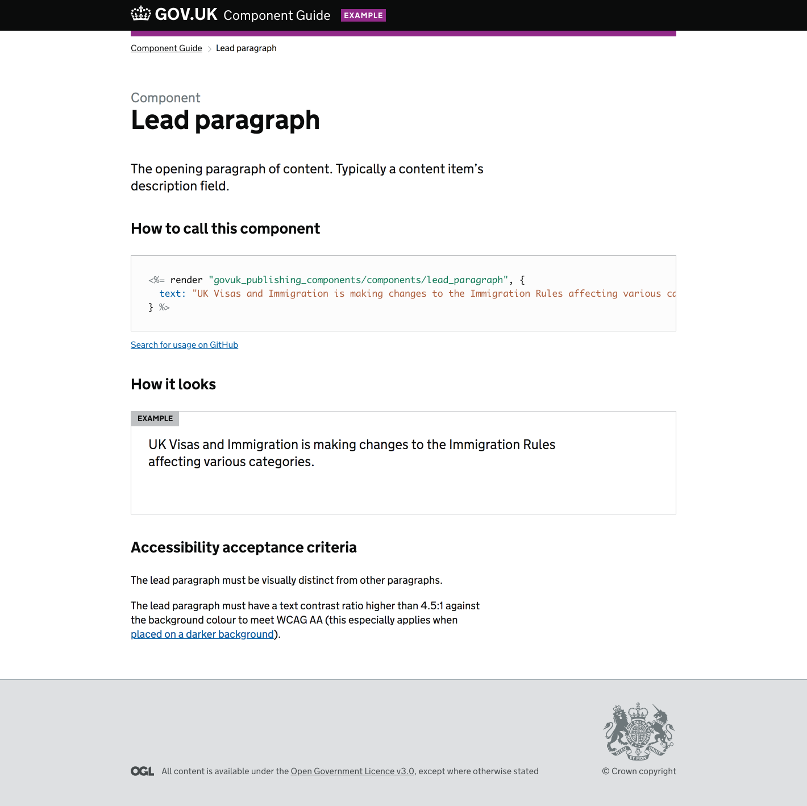

# GOV.UK Publishing Components

A gem to document components in GOV.UK frontend applications.



## Write components in your application

Components are packages of template, style, behaviour and documentation that live in your application.

A component must:
* [meet the component principles](docs/component_principles.md)
* [follow component conventions](docs/component_conventions.md)

A lead paragraph component would be included in a template like this:

```erb
<%= render 'components/lead-paragraph', text: "A description is one or two leading sentences" %>
```

## Set up a component guide

This gem creates a component guide for all your application’s components.

An example guide this gem created for government-frontend:
https://government-frontend.herokuapp.com/component-guide

The guide includes your application’s `application.scss` and `application.js` files by default. This is [configurable](#configuration).

### Install gem

Add this line to your application's Gemfile in the [development and test groups](http://bundler.io/v1.12/groups.html#grouping-your-dependencies):

```ruby
gem 'govuk_publishing_components'
```

And then execute:
```bash
$ bundle
```

### Mount the component guide

Mount the component guide in your application:

```ruby
# config/routes.rb
unless Rails.env.production?
  mount GovukPublishingComponents::Engine, at: "/component-guide" if defined?(GovukPublishingComponents)
end
```

If your application was government-frontend the component guide would be at:
http://government-frontend.dev.gov.uk/component-guide

### Configure the gem

Use a config block in an initializer:

```ruby
# config/initializers/govuk_publishing_components.rb
if defined?(GovukPublishingComponents)
  GovukPublishingComponents.configure do |c|
    c.component_guide_title = "My component guide"

    c.application_stylesheet = "custom_stylesheet" # Defaults to "application"
    c.application_print_stylesheet = "print" # Not included by default
    c.application_javascript = "custom_javascript" # Defaults to "application"
  end
end
```

## Component generator

The gem includes a component generator to stub the minimal files required for a component.

```ruby
rails generate govuk_publishing_components:component [component_name]
```

This will create a template, scss file and yml documentation file for a new component. It will not create a test file as this cannot be reliably done automatically across applications, but a test file will be necessary.

## Integration with Heroku
To make the best use of the component guide we use Heroku to serve the current `master` build and whenever a [pull request is added](https://devcenter.heroku.com/articles/github-integration-review-apps)

When an app is deployed to Heroku it will be in `production` mode, so only gems that are in the main group will be installed and made available.
To ensure that we only load the guide on Heroku and not when deployed to _production_ we need to have the gem included in the main bundle group in the Gemfile.
For this use case we need `require: false` so that it's not loaded in _production_ but then we can manually `require` the gem in our `application.rb` based on the more complex environmental logic that we've specified.

First move the gem outside of the `development`, `test` groups and set require to false. ([example](https://github.com/alphagov/government-frontend/blob/5110d3d33f7a6b63f218b889a5afec90e6df810f/Gemfile#L11)):

```ruby
# Gemfile
gem 'govuk_publishing_components', require: false
```

Now we can manually require the gem ([example](https://github.com/alphagov/government-frontend/blob/5110d3d33f7a6b63f218b889a5afec90e6df810f/config/application.rb#L14)):

```ruby
# config/application.rb
if !Rails.env.production? || ENV['HEROKU_APP_NAME'].present?
  require 'govuk_publishing_components'
end
```

## Licence

[MIT Licence](LICENCE.md)

## Development
For documentation on how to update and develop this gem see [DEVELOPMENT.md](./DEVELOPMENT.md)
