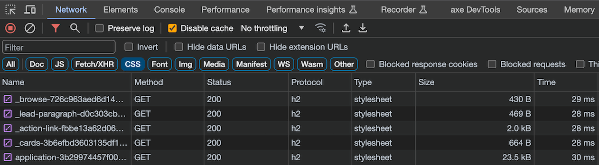

# Set up individual component CSS loading

Set the component gem up so that rendering applications can (optionally) load each component's stylesheet individually, as described in [RFC #149](https://github.com/alphagov/govuk-rfcs/pull/152).

## TL;DR

An array for stylesheet names is set up in the rendering application using a helper. Templates can then add the names of stylesheets to the array, which is then used by the application to output all the stylesheets needed on the page.

Example of rendering application upgrade: <https://github.com/alphagov/government-frontend/pull/2734>

## Initial set up

There are 3 types of stylesheet that are used across GOVUK:

- CSS from components in the gem
- CSS from components in the application
- CSS from views in the application

The helper adds each type of stylesheet to the array - gem components, app components, and views.

Any other styles should be added in the application's `application.scss` file.

Four shorthand methods for adding each type of stylesheet to the array:

- `add_gem_component_stylesheet`
- `add_app_component_stylesheet`
- `add_view_stylesheet`
- `add_stylesheet_path`

The first three take the name of the Sass file relevant to the component or view:

```ruby
add_gem_component_stylesheet("accordion")
```

```ruby
add_app_component_stylesheet("calendar")
```

```ruby
add_view_stylesheet("homepage")
```

There is also 1 generic method that takes a file path:

```ruby
add_stylesheet_path("views/dir-1/_partial.css")
```

## Precompiling

Gem component stylesheets are automatically precompiled. Application component and view stylesheets should be added to the application's manifest file to be precompiled, included and served.

## Known problems

### Nested components in GOV.UK Frontend

GOV.UK Frontend has components that use other components - for example, both the radio button and character count component include the label component. These are deduped by GOV.UK Frontend when compiling the CSS to a single file.

As this pull request includes the stylesheets for the components individually, this will mean that both the radio stylesheet and the character count stylesheet will include the label component.

This shouldn't make a difference in visual appearance of the site, but does mean some CSS is unnecessarily included twice.

The page sizes were calculated from individual compiled CSS files, so there still is a performance improvement - but it could be further improved.

Ideally there'd be a way of including only the components without including the nested components; for example, the partial for radio inputs would include both the label and radio:

```ruby
add_gem_component_stylesheet("label")
add_gem_component_stylesheet("radio")
```

which would then be deduped before being added to the array of stylesheets.

### Increased request header size

Starting with Rails 6.1 [preload_links_header](https://guides.rubyonrails.org/configuring.html#config-action-view-preload-links-header) is set to `true` by default, this ensures the `javascript_include_tag` and `stylesheet_link_tag` will generate a [Link header](https://developer.mozilla.org/en-US/docs/Web/HTTP/Headers/Link) that preloads assets.

If your application is using the individual loading of stylesheets feature and `preload_links_header` is set to `true`, you will likely see an increase in the header size for each page. This is important to be aware of as you may need to configure your web server to allow for larger header sizes, example PR - [increasing the cache size in NGINX](https://github.com/alphagov/govuk-puppet/pull/11846).

## Step by step changes to the rendering application

### Add stylesheets to be precompiled

Add stylesheet paths in `app/assets/config/govuk_publishing_components_sassc-rails_manifest.js`:

```diff
+  //= link govuk_publishing_components/components/_accordion.css
+  //= link govuk_publishing_components/components/_action-link.css
+  //= link govuk_publishing_components/components/_attachment.css
+  //= link govuk_publishing_components/components/_attachment-link.css
   ...
```

**Note**, that while GOV.UK Publishing Components supports applications which include both LibSass or Dart Sass, you'll need to add and remove stylesheet paths in the Sprockets manifest as detailed above.

Remove gem component imports from `app/assets/stylesheets/application.scss`:

```diff
- @import "govuk_publishing_components/components/accordion";
- @import "govuk_publishing_components/components/action-link";
- @import "govuk_publishing_components/components/attachment";
- @import "govuk_publishing_components/components/attachment-link";
  ...
```

### Using the publishing components gem without the `static` rendering app

The `static` rendering application already includes several components from the publishing components gem - [static application.scss](https://github.com/alphagov/static/blob/main/app/assets/stylesheets/application.scss)

To avoid requesting the same stylesheet twice, we exclude any stylesheets included in `static` by default.

If you are using the individual assets loading feature in an app that does not rely on `static`, we recommend adding the config file below in your application to ensure that the components render correctly.

```rb
# config/initializers/govuk_publishing_components.rb
GovukPublishingComponents.configure do |c|
  c.exclude_css_from_static = false
end
```

If you are not using static but you want to provide your own application css which bundles component css includes, and you do not want them to also be included as individual component stylesheets, you can provide a custom list of components to exclude. These component should be ones that you have explicitly
included in your application stylesheet:

```rb
# config/initializers/govuk_publishing_components.rb
GovukPublishingComponents.configure do |c|
  c.custom_css_exclude_list = %w[button feedback label
                                 layout-footer layout-super-navigation-header layout-header]
end
```

#### Add the app components and views to the stylesheet array

This bit will likely take the most time - and really benefits from a comprehensive list of what pages use which templates (and template variations).

Add the `add_view_stylesheet` and `add_app_component_stylesheet` helpers to each view, usually this will be at the top of the file.

```rb
add_view_stylesheet("homepage")
```

```rb
add_app_component_stylesheet("calendar")
```

Each stylesheet that is used individually will need an extra `@import` added to allow them to use GOV.UK Frontend variables and mixins:

```scss
@import "govuk_publishing_components/individual_component_support";
```

#### Hoist body content to the top of your layouts

This will ensure that all components and views are discovered, before `render_component_stylesheets` is called, and their respective stylesheets added inside the `<head>`. Otherwise, components and view partials added in body content are not rendered in time and associated stylesheets are not included.

```rb
<% content_for :body do %>
  <main id="content">
    <%= yield %>
  </main>
<% end %>

<!DOCTYPE html>
...
```

Use `yield` to add body content between `<body>` and `</body>`:

```rb
<%= yield :body %>
```

##### Add the stylesheets just before the closing `</head>` tag of the base template

```rb
  <head>
    <meta charset="utf-8" />
    <%= stylesheet_link_tag 'application', :media => "all", integrity: false %>
    ...
    <%=
      render_component_stylesheets
    %>
  </head>
```

### Check stylesheets are loading individually

When the setup is complete, only the component stylesheets required to render the page are requested. For example, the screenshot below displays network activity for a [browse page e.g. benefits](https://www.gov.uk/browse/benefits) and shows separate network requests for the `browse`, `lead-paragraph` and `cards` stylesheets:



## Why

See [RFC #149](https://github.com/alphagov/govuk-rfcs/pull/152) for more details about this approach.
